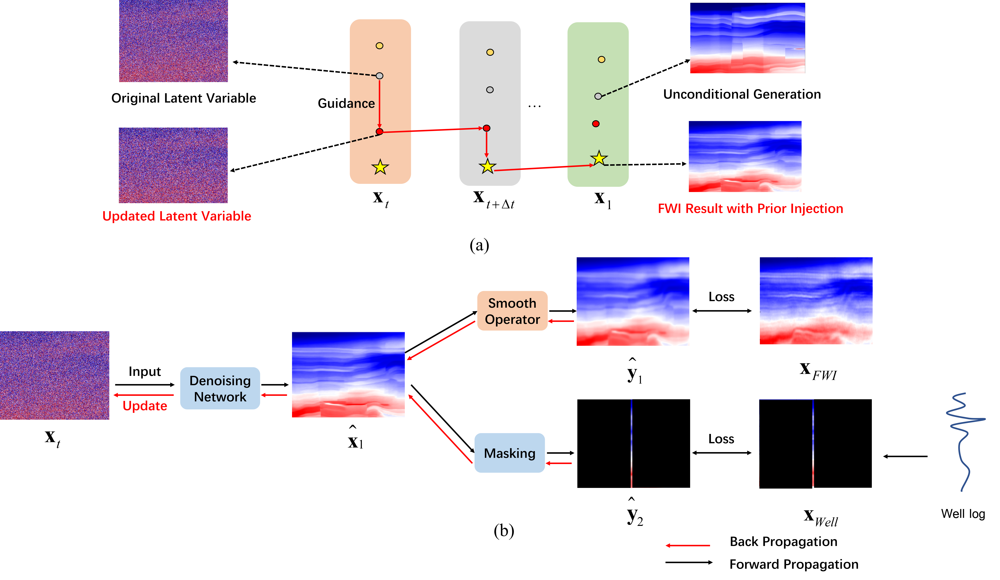
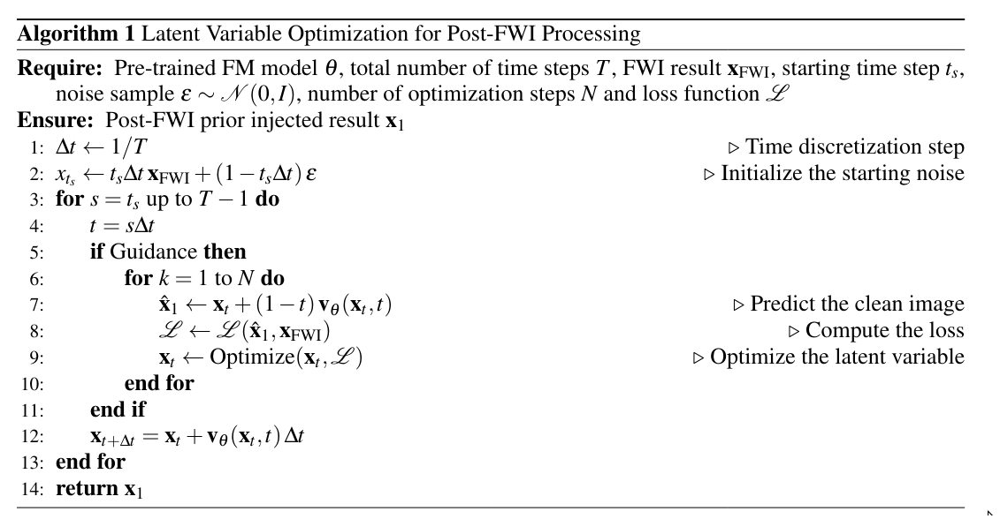

Reproducible material for ** Post-FWI Injection of Learned Priors Using a Flow Matching Model **
The article has been submited to Journal and the preprint article can found at  [Post-FWI Injection of Learned Priors Using a Flow Matching Model](https://arxiv.org/abs/2607.23719)


# Project structure
This repository is organized as follows:

* 📁 **package**: Core Python modules implementing the U-Net architecture and Flow Matching framework.

* 📁 **asset**: Project-related visual assets, including logos and illustrative figures.

* 📁 **data**: Viking dataset, containing a FWI result.

* 📁 **notebooks**: Jupyter notebooks for reproducing the otway experiment presented in this work.


## Notebooks
The following notebooks are provided:

- :orange_book: ``Example_viking.ipynb``: notebook performing prior injection test on Viking Dataset;

## Trained Model
Download the pretrained model from the provided link: [Google Drive](https://drive.google.com/file/d/1m3DJkpKzpGhPKJtvKe5w7F1XgyQCL9wh/view?usp=drive_link&utm_source=chatgpt.com). Place the downloaded file in the `notebooks/checkpoints/` directory.


## Getting Started :space_invader: :robot:

To ensure reproducibility, we recommend creating the environment using the provided `environment.yml` file.

Run the following command:

```bash
./install_env.sh
```

The installation may take a few minutes. After installation, run.

Activate the environment using:

```bash
conda activate postFWI
```

You can start testing by running the notebook in the `./notebooks/` directory:


**Disclaimer:** All experiments have been carried on a Intel(R) Xeon(R) Gold 6230R CPU @ 2.10GHz equipped with a single NVIDIA RTX A6000 GPU. Different environment 
configurations may be required for different combinations of workstation and GPU.
